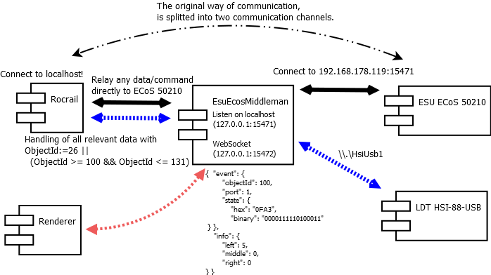

[](https://github.com/cbries/RocrailHsi88UsbProxy/actions/workflows/msbuild.yml)

[](https://github.com/cbries/RocrailHsi88UsbProxy/actions/workflows/dailyBuild.yml)

# Motivation

I used a ESU ECoS 50210 and several LDT's S88 feedback devices. After a while the ECoS' feedback device does not recognizes any input anymore, the LDT's still worked after adding an `HSI-88-N`. But then I realized that `Rocrail` does not support the `HSI-88-USB`, only the old fashioned `HSI-88` with serial connection (no USB!).

My used hardware & software:

- `RM-88-N`, 16-fold Standard-Feedback Module, https://www.ldt-infocenter.com/dokuwiki/doku.php?id=de:rm-88-n
- `HSI-88-USB`, High Speed Interface for the s88-Feedbackbus!, https://www.ldt-infocenter.com/dokuwiki/doku.php?id=de:hsi-88-usb
- `ESU ECoS 50210`, https://www.esu.eu/en/products/digital-control/ecos-50210-dcc-system/what-ecos-can-do/
- so far I used: `Rocrail`, https://wiki.rocrail.net/doku.php?id=start

# Idea

The communication protocol between the ECoS and the outside world is plaintext-based. It looks like this:

```
get(1, info)
get(1, status)
<REPLY get(1, info)>
1 ECoS2
1 ProtocolVersion[0.5]
1 ApplicationVersion[4.2.13]
1 HardwareVersion[2.1]
<END 0 (OK)>
<REPLY get(1, status)>
1 status[STOP]
<END 0 (OK)>
queryObjects(26,ports)
<REPLY queryObjects(26,ports)>
100 ports[16]
101 ports[16]
102 ports[16]
103 ports[16]
<END 0 (OK)>
get(100, state)
get(101, state)
get(102, state)
get(103, state)
<REPLY get(100, state)>
100 state[0x0]
<END 0 (OK)>
<REPLY get(101, state)>
101 state[0x0]
<END 0 (OK)>
<REPLY get(102, state)>
102 state[0x0]
<END 0 (OK)>
<REPLY get(103, state)>
103 state[0x0]
<END 0 (OK)>
```

Just connect with `telnet` (i.e. `$ telnet 192.168.178.119 15471`) or an other terminal network tool and enter the mentioned commands. 

`EsuEcosMiddleman` (so-called `ManInTheMiddle (MITM)`) is started locally, starts a local server to which `Rocrail` connects like normal. MITM splits the commands into two channels:

a) one for the S88 data
	
b) the second for all other data
	
It will work like a normal connection, as it would established when used directly. But the S88-data is fetched from the `HSI-88-USB` device and weaved into the data stream.

The following figure provides a bird-view of this approach.



# Environment

Tested and build for Windows environments only.

# Release 

When any change is pushed the daily build will provide a new portable Release.

Just unzip and run the executable.

# Testbed

## Byteorder

To research the byte order structure I installed a single LDT `RM-88-N-Opto` and verified the received data. The setup commands are:

```
> t1            (send)
< t1     
> s010000       (send, one feedback device a string "left")
< s01
< i01010000
> v
< V. 1.08 / HSI-88-USB / 1.05r Win 10 (64) / (c) 2011 LDT & Flakner
> m
< m01010000
```

After the setup just connect a wire from the railroad (mass, brown/black) to the input pins of the feedback device.

Result:

```
PIN     Data from HSI-88-USB

01      i01010001
02      i01010002
03      i01010004
04      i01010008

05      i01010010
06      i01010020
07      i01010040
08      i01010080

09      i01010100
10      i01010200
11      i01010400
12      i01010800

13      i01011000
14      i01012000
15      i01014000
16      i01018000
```

# Setup 

The runtime can be configured by json-based configuration file named `EsuEcosMiddleman.json`, it lays side-by-side to the executable within the build directory, e.g. `bin\Release\EsuEcosMiddleman.exe`.

- `hsi/devicePath` is required to address you attached `HSI-88-USB` device
- `ecos/ip` is the ip address of your ECoS

## Debouncing

It has been shown that the HSI-88-USB detects any change, as well very small triggers. Sometimes very often when trains crosses a single detection area. This can slow down any railway control software because of status/command flooding and when several logging mechanism are switched on (e.g. `log4net` with `INFO` or `DEBUG` level).

To reduce this a debouncing functionality can help. When any approach exist in the hardware directly, just it, because it will be much faster and reliable. In any other cases you can configure global debouncing walltime in `EsuEcosMiddleware.json`.

The values are milliseconds, only real pin state changes after this walltime are handled and provided to connected clients.

```json
{
  ...
    "debounce": {
      "onMs": 20,
      "offMs": 2000
    },
  ...
}
``` 

# Runtime / Demonstration

The following screenshots show the software in action for a real model railway.


